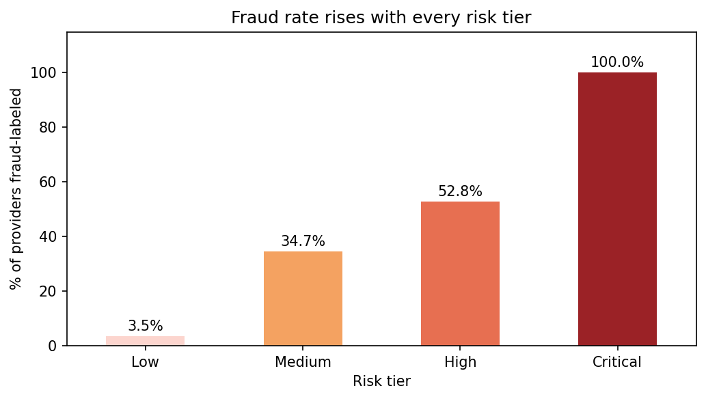
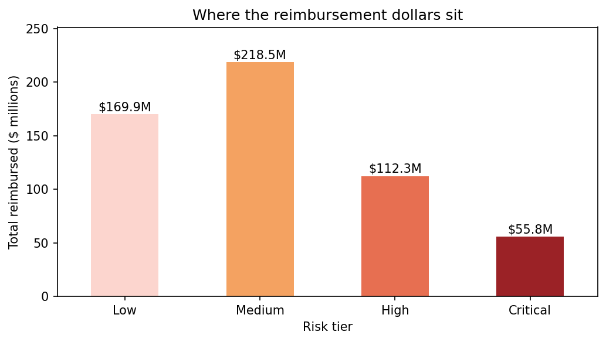
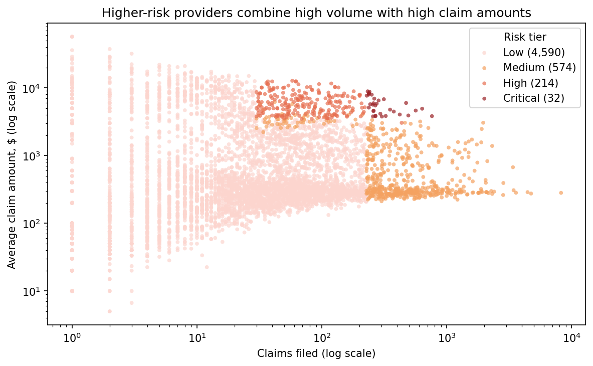

# Medicare Provider Risk Screening

An explainable, SQL-based risk score that helps compliance auditors decide which healthcare providers to review first.

**Tools:** Python · SQL (SQLite) · pandas · matplotlib

---

## The problem

Healthcare fraud costs Medicare and Medicaid billions of dollars every year, and compliance teams cannot manually review every provider. This project asks: **can billing data alone point auditors to the providers most worth reviewing first, with reasons they can explain?**

## The data

[Healthcare Provider Fraud Detection Analysis](https://www.kaggle.com/datasets/rohitrox/healthcare-provider-fraud-detection-analysis) (Kaggle, Medicare-based). I used the four Train files:

| File | Rows | Contents |
|---|---|---|
| Provider labels | 5,410 | Provider ID and a "potentially fraudulent" label (Yes/No) |
| Beneficiary | 138,556 | Patient demographics and chronic conditions |
| Inpatient claims | 40,474 | Hospital-admission claims |
| Outpatient claims | 517,737 | Non-admission claims |

Together: **5,410 providers, 558,211 claims, about $557M in reimbursements.** 506 providers (9.4%) carry the fraud label.

The raw data is not included in this repository. Download it from Kaggle (link above) and place the four Train CSVs in a `data/` folder.

---

## Approach

1. **Loaded and joined** the four files into a SQLite database. Stacked inpatient and outpatient claims into one view (`UNION ALL`) and built a per-provider summary view.
2. **Compared** providers labeled potentially fraudulent against the rest on five ideas: claim volume, claim amount, repeat patients, chronic-condition mix, and inpatient share.
3. **Kept what the data supported** and discarded what it did not (see findings).
4. **Built a points-based risk score** from the three signals that held up. Cutoffs are calculated inside the SQL query (top 10% of providers), so no numbers are hardcoded.
5. **Checked the score** against the fraud labels, which were *not* used to build it.
6. **Produced an audit shortlist** with the evidence and dollars behind each flag.

## Findings

| Signal | Not fraud-labeled | Fraud-labeled | Used in score? |
|---|---|---|---|
| Avg claims per provider | 70.4 | 420.5 | Yes |
| Avg claim amount | $1,524 | $3,843 | Yes |
| Share of claims that are inpatient | 4.9% | 11.0% | Yes |
| Claims per patient | 1.31 | 1.48 | No, difference too small |
| Avg chronic conditions per patient | 4.32 | 4.32 | No, no difference |

Two ideas I expected to matter (sicker patients, repeat billing of the same patients) did not hold up, so they were kept out of the score.

## The risk score

One point for each of the following, for a score of 0 to 3:

- **High volume:** at least 228 claims (top 10% of providers)
- **High claim amount:** average claim of about $3,377 or more (top 10% among providers with 30+ claims)
- **Inpatient-heavy:** about 32% or more of claims are inpatient (top 10% among providers with 30+ claims)

**Small-sample rule:** providers with fewer than 30 claims cannot earn the amount or inpatient points. My first version had no such rule, and the fraud rate *dropped* from score 1 to score 2. The cause was providers with only a handful of claims, whose averages and percentages swing wildly. Requiring 30 claims fixed the ordering. *(I chose 30 after seeing the first result, so this is a judgment call.)*

## Results

The share of fraud-labeled providers rises with every point:

| Risk tier | Score | Providers | Fraud-labeled |
|---|---|---|---|
| Low | 0 | 4,590 | 3.5% |
| Medium | 1 | 574 | 34.7% |
| High | 2 | 214 | 52.8% |
| Critical | 3 | 32 | 100% |



**Recommended audit shortlist: the 246 providers scoring 2 or higher.**

- 4.5% of providers, but **$168M (30%) of reimbursement dollars**
- **59% precision:** 145 of 246 are fraud-labeled, versus a 9.4% base rate
- **6.3x lift** over picking providers at random
- The 32 Critical providers alone account for $56M




The full ranked list, with a plain-English "why flagged" for each provider, is in `outputs/audit_shortlist.csv`.

## Limitations

- **A prioritization tool, not proof of fraud.** Flagged providers need human review, and some are probably legitimate (large hospitals, for example).
- **Low recall.** The shortlist finds 29% of fraud-labeled providers (145 of 506). Many do not stand out on these three measures. Lowering the threshold to score 1 catches more but flags many more legitimate providers. The right trade-off depends on audit capacity.
- **The label is "potentially fraudulent,"** not confirmed fraud.
- **Tuned and tested on the same data.** A real deployment should validate on unseen data.
- **One snapshot in time.** Billing patterns and fraud tactics change.

## Reproduce it

1. Download the four Train CSVs from Kaggle into `data/`.
2. Install dependencies: `pip install pandas matplotlib` (SQLite ships with Python).
3. Open `mednotebook.ipynb` and run the cells top to bottom. The notebook creates the database, views, score, charts, and output files.

## Repository structure

```
.
├── README.md
├── mednotebook.ipynb           # full analysis: loading, SQL, scoring, charts
├── outputs/
│   ├── provider_scorecard.csv  # all 5,410 providers with scores and evidence
│   └── audit_shortlist.csv     # 246 providers scoring 2+, ranked
├── images/                     # charts used in this README
└── data/                       # not included; see "The data"
```

---

**Author:** Terhas Gebreyohannes · [LinkedIn](www.linkedin.com/in/terhas-tekleslassie)
